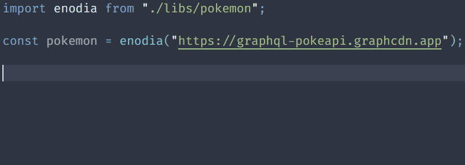

# Enodia

Enodia is a GraphQL client and server generator for Typescript projects. It
generates fully typed client and server files from your GraphQL schema, allowing
you to have automatic types in return of your queries and mutations, type safety
when providing arguments and fields, and a fully typed server to ensure your
resolvers return the expected values.



## Installation

As Enodia is needed only to generate the files, you can install it as a dev
dependency:

```bash
npm install -D enodia
```

Finally, you will need to setup an `enodia.config.ts` file at the root of your
project. This file should export an object with the following properties:

```typescript
export default {
  // This is either the path to your graphql schema, or the URL where your API runs
  schema: "./src/graphql.schema",
  // If you only want to generate the server side, you can omit this
  client: {
    // This is the path where you want the client to be generated
    path: "./src/web/enodia.ts"
  },
  server: {
    // This is the path where you want the server to be generated
    path: "./src/server/enodia.ts"
  }
  // If you use custom scalars, you have to define them here
  scalars: {
    // This is a map of custom scalar types in your GraphQL schema to Typescript types.
    // For example, if your GraphQL schema has a `Date` scalar type, you can map
    // it to the `Date` type in Typescript.
    Date: { name: "Date" },
  },
};
```

More information on this file in the [configuration section](#configuration).

## Usage

### Generating the client

Once your `enodia.config.ts` file is setup, you can simply run Enodia:

```bash
npx enodia
```

This will generate a client and a server file at the given paths. You should
.gitignore the generated file.

### Using the client

The generated file exports a simple `enodia` function, which takes the URL of
your API as a first parameter. The second parameter is a configuration object,
allowing you to inject a custom `fetch` function. This can be used to handle
authentication, for example. This function will return the instantiated client.
The client has two properties, `query` and `mutation` containing functions to
call every query and mutation your GraphQL API exposes.

## Configuration

### `schema`

Enodia needs a GraphQL schema definition to generate the client and server. You
can either point to a GraphQL file:

```typescript
export default {
  input: "./path/to/schema.graphql",
};
```

Or provide the URL of your GraphQL API:

```typescript
export default {
  input: "http://localhost:3000/graphql",
};
```

Note that your API will need to be running for Enodia to generate the files.

### `client`

#### `path`

If you want to generate the client, you will need to provide its path:

```typescript
export default {
  client: {
    path: "./path/to/client.ts",
  },
};
```

#### `react`

Enodia can also generate React hooks for each query and mutations. All you need
for it is to specify the API URL to call:

```typescript
export default {
  client: {
    react: {
      url: "http://localhost:3000/graphql",
    },
  },
};
```

As the config file is written in Typescript, you can rely on environment
variables. Note that Enodia does not parse dotenv files by default, so you may
need to rely on the `dotenv` library.

```typescript
import "dotenv/config";

export default {
  client: {
    react: {
      url: process.env.GRAPHQL_API_ENDPOINT,
    },
  },
};
```

### `scalars`

This is a map of scalar types in your GraphQL schema to Typescript types. For
example, if your GraphQL schema has a `Date` scalar type, you can map it to the
`Date` type in Typescript.

```typescript
export default {
  scalars: {
    Date: { name: "Date" },
  },
};
```

If you need to use custom types, you can also provide a `path` property, which
will be used to import the type from the generated client file.

```typescript
export default {
  scalars: {
    Json: { name: "Json", path: "./types" },
  },
};
```

The `name` property is optional when providing a `path`, if the returned type is
the default export of the module.
